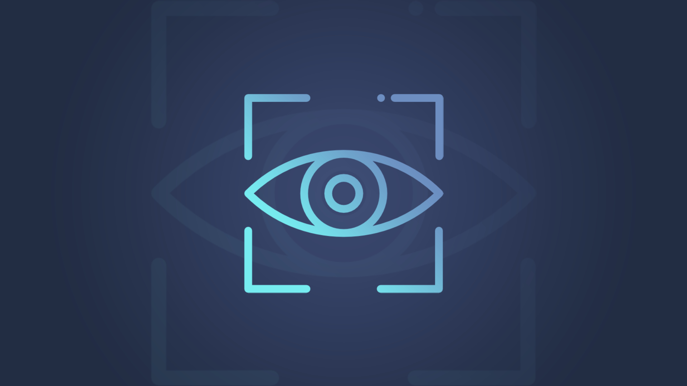

# Computer Vision for Document AI
<a style="float:left;" href="https://www.neos.hr/news-neos/"></a>
<a style="float:left;" href="https://hr.linkedin.com/company/neos-hr/"></a>
<a style="float:left;" href="https://twitter.com/neos_hr"></a>
<a style="float:left;" href="https://www.facebook.com/neos.hr"></a>
<br>
<br>
<br>
A case study if Computer Vision applied to receipt detection. Examples in Python implemented in OpenCV and Tesseract OCR.
<br>
To get started, ensure you have Tesseract-Lang installed on your machine.
<br>
Then, install the required packages from the file (preferably inside a virtual environment):
<br><br>

```
pip install -r requirements.txt
```

Activate the environment and you're ready to go!
<br><br>


## Content
<hr>

    ├── data
    │   ├── example1.jpg         <- First receipt image
    │   ├── receipt.jog          <- Second receipt image
    │   └── banner.jpeg          <- Banner for this project
    │
    ├── LICENSE
    ├── README.md
    │
    ├── 001_ReadReceipts.ipynb   <- Jupyter notebook for processing receipt image and reading all text from it
    ├── 002.ExtractData.ipynb    <- Jupyter notebook for area detection and purchased item extraction
    └── requirements.txt         <- All Python libraries that notebooks depend on

## Resources
<hr>
- [Blog-post-TBA](https://neos.hr)<br>
- [Oracle Cloud Vision](https://www.oracle.com/artificial-intelligence/vision/#rc30p2)
